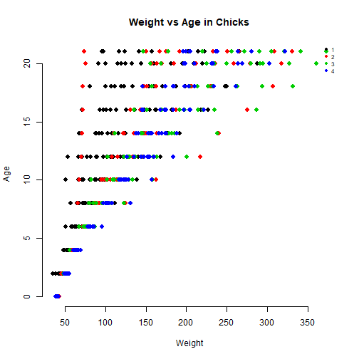

Developing Data Products - Shiny App 
========================================================
author: Jessica Ginesta Legasto
date: 4/2/2019
autosize: true
font-family: 'Helvetica'

Overview
========================================================

This was built as part of a deliverable for the course Developing Data Products as part of the Coursera Data Science Specialization.

- The app developed for the first part of the assignment demo is avalilable at: https://jginesta92.shinyapps.io/myapp/

- Source code for ui.R and server.R files are available on the GitHub repo: https://github.com/jginesta/DevDataProducts_ShinyApp


Functionality
========================================================
This Shiny App is providing tools to be able to analyze the different parameters of the ChickWeight dataset.

We required you to provide the following information:

1. Filter by Diet to display a table with Chicks that follow that diet.

2. Select the X axis to be used in the plot.

3. Select the Y axis to be used in the plot.

4. Select points in the graph to be able to get the slope and intercept (the minimum points selected must be 3)

5. Click Submit

The main tab will show the plot with the x and y axis selected and two tables. The table on the left will show the full dataset for ChickWeight. The table on the right will only show the dataset for the Diet that was selected.

ChickWeight Dataset
========================================================
The dataset used in ChickWeight and below is what the dataset looks like.


```r
dim(ChickWeight)
```

```
[1] 578   4
```

```r
summary(ChickWeight)
```

```
     weight           Time           Chick     Diet   
 Min.   : 35.0   Min.   : 0.00   13     : 12   1:220  
 1st Qu.: 63.0   1st Qu.: 4.00   9      : 12   2:120  
 Median :103.0   Median :10.00   20     : 12   3:120  
 Mean   :121.8   Mean   :10.72   10     : 12   4:118  
 3rd Qu.:163.8   3rd Qu.:16.00   17     : 12          
 Max.   :373.0   Max.   :21.00   19     : 12          
                                 (Other):506          
```

The App
========================================================
This example shows the scenario where the user chooses Weight in the x axis and Time in the y axis.


